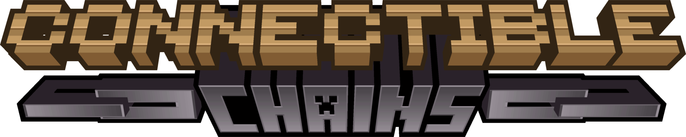

  

# Reconnectible Chains

Connect your fences/walls with a decorative chain!

Reconnectible Chains is a **multiloader** port of
legoatoom's [Connectible Chains](https://github.com/legoatoom/ConnectibleChains). For more information on the mod in
general, please see the [original modpage](https://modrinth.com/mod/connectiblechains). Reconnectible Chains is _not_
officially supported by legoatoom, please do not report issues with this mod on their issue tracker. Instead,
see [this mod's issue tracker](https://github.com/evanbones/Reconnectible-Chains/issues).

## What's New?

* Native Forge/NeoForge port.
* Adjust slack on a per-chain basis by right-clicking with Shears.
* Added new config options to disable chain collisions and increased max chain length.
* You can now punch knots directly to break them.
* Knots break instantly instead of waiting a couple seconds.
* Using Shears to break knots now reduces its durability.
* Plenty of bug fixes, with more being added frequently.
* Safer knot discarding, should fix issues with knots across chunk borders.
* Additional safety checks for collision entities on dedicated servers.

## Compatibility With Other Mods

A number of mods are natively supported, namely:

* Farmer's Delight (Rope)
* Supplementaries (Rope)
* Beautify (Rope)
* Critters and Companions (Silk Lead)
* Any mods that correctly tag their chains with `#c:chains`

See [the wiki](https://github.com/legoatoom/ConnectibleChains/wiki/Customization-and-Compatibility) for information on
adding additional mod compatibility.

## License

---

 